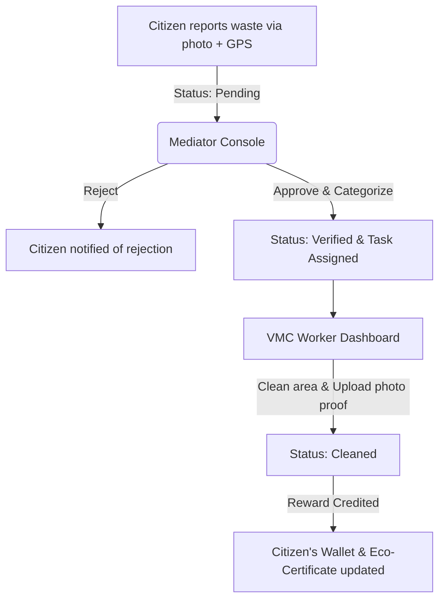

# 🌿 Greenify - Smart Waste Reporting & Municipal Cleanup System

[](https://react.dev/)
[](https://vitejs.dev/)
[](https://www.typescriptlang.org/)
[](https://tailwindcss.com/)
[](https://supabase.com/)
[](https://www.mapbox.com/)

> **Making Cities Cleaner, One Report at a Time.**
> Greenify is a community-driven smart waste management platform designed to connect citizens, mediators, and municipal workers (VMC) to report, verify, and resolve pollution hotspots while rewarding civic action.

📁 **GitHub Repository:** [https://github.com/Gopi2870/mindsprint2025](https://github.com/Gopi2870/Greenify)

---

## 📖 Table of Contents

- [🌿 Greenify - Smart Waste Reporting \& Municipal Cleanup System](#-greenify---smart-waste-reporting--municipal-cleanup-system)
  - [📖 Table of Contents](#-table-of-contents)
  - [🚀 Key Features](#-key-features)
    - [📸 1. Citizen Portal](#1-citizen-portal)
    - [⚖️ 2. Mediator Console](#2-mediator-console)
    - [🚛 3. VMC Worker Dashboard](#3-vmc-worker-dashboard)
    - [📊 4. Admin Control Center](#4-admin-control-center)
  - [🔄 Workflow & Role Architecture](#-workflow--role-architecture)
  - [🛠️ Tech Stack](#️-tech-stack)
  - [⚙️ Setup \& Installation](#️-setup--installation)
    - [Prerequisites](#prerequisites)
    - [1. Clone the Repository](#1-clone-the-repository)
    - [2. Install Dependencies](#2-install-dependencies)
    - [3. Configure Environment Variables](#3-configure-environment-variables)
    - [4. Run Locally](#4-run-locally)
    - [5. Build for Production](#5-build-for-production)
  - [📂 Directory Structure](#-directory-structure)
  - [🔒 License](#-license)

---

## 🚀 Key Features

### 📸 1. Citizen Portal
- **Report Pollution:** Snap a photo of waste or illegal dumping. The app captures GPS coordinates and timestamps automatically.
- **My Wallet:** Earn reward points and cashback (₹) for every verified and cleaned location. Track transactions and withdraw funds.
- **Activity Map:** View an interactive map showing all your reported locations and their current cleanup status.
- **Subscription Plans:** Choose between Basic (Free), Pro, or Green Hero plans to get benefits like multiplier reward points, priority verification, and digital eco-certificates.

### ⚖️ 2. Mediator Console
- **Pending Verification Queue:** Real-time stream of incoming reports submitted by citizens.
- **Verify & Categorize:** Inspect report descriptions, check the geographical coordinates, filter by category (organic, plastic, metal, mixed, e-waste), and approve/reject claims.

### 🚛 3. VMC Worker Dashboard
- **Task Assignment:** View details of active cleanup tasks assigned by mediators or administrators.
- **GPS Routing:** Navigate to waste hotspots using live Mapbox GPS indicators showing the closest path.
- **Before/After Validation:** Upload cleanup evidence directly from the field and mark tasks as resolved to trigger citizen rewards.

### 📊 4. Admin Control Center
- **Overall Statistics:** Track active citizens, reports submitted, locations cleaned, and total rewards distributed.
- **Management Tabs:** Control user profiles, municipal cleanup teams, regional mediators, and active tasks.
- **GPS Live Tracking:** View the locations of waste hotspots and active cleanup trucks on an interactive dashboard.

---

## 🔄 Workflow & Role Architecture



1. **Citizen** submits a report detailing the type of waste, location, and description.
2. **Mediator** reviews the submission, verifies authenticity, and assigns a team.
3. **VMC Worker** navigates to the location, cleans up the waste, uploads confirmation, and completes the task.
4. **System** updates the citizen's wallet with points/cashback and issues eco-credits.

---

## 🛠️ Tech Stack

- **Frontend Framework:** [Vite](https://vitejs.dev/) + [React 18](https://react.dev/) + [TypeScript](https://www.typescriptlang.org/)
- **State Management & Querying:** [TanStack React Query (v5)](https://tanstack.com/query/latest)
- **Styling & Components:** [Tailwind CSS](https://tailwindcss.com/) + [shadcn/ui](https://ui.shadcn.com/) (Radix UI primitives)
- **Database & Auth:** [Supabase JS Client](https://supabase.com/)
- **Animations:** [Framer Motion](https://www.framer.com/motion/)
- **Maps Integration:** [Mapbox GL](https://www.mapbox.com/)
- **Data Visualizations:** [Recharts](https://recharts.org/)
- **Notifications:** [Sonner](https://github.com/emilkowalski/sonner) & Radix Toast

---

## ⚙️ Setup & Installation

### Prerequisites
Make sure you have [Node.js (v18+)](https://nodejs.org/) and `npm` installed.

### 1. Clone the Repository
```bash
git clone https://github.com/Gopi2870/mindsprint2025.git
cd mindsprint2025
```

### 2. Install Dependencies
```bash
npm install
```

### 3. Configure Environment Variables
Create a `.env` file in the root directory and add your Supabase credentials:
```env
VITE_SUPABASE_URL="https://your-project-id.supabase.co"
VITE_SUPABASE_PUBLISHABLE_KEY="your-supabase-anon-key"
```

*Note: For local testing, a fallback client configuration is already established.*

### 4. Run Locally
Start the development server with hot-reload:
```bash
npm run dev
```
Open your browser and navigate to `http://localhost:5173` to view the application.

### 5. Build for Production
To build the application for deployment:
```bash
npm run build
```
You can preview the built site locally using:
```bash
npm run preview
```

---

## 📂 Directory Structure

```text
├── public/                  # Static assets
├── src/
│   ├── components/
│   │   ├── common/          # Reusable UI components (StatCard, badges)
│   │   ├── layout/          # Page layouts (Navbar, Footer, Dashboards)
│   │   └── ui/              # shadcn UI components (dialog, button, alert)
│   ├── data/
│   │   └── mockData.ts      # Demo users, tasks, and system data
│   ├── hooks/               # Custom React hooks
│   ├── integrations/
│   │   └── supabase/        # Database client setup and typings
│   ├── lib/                 # Core utilities (cn helper, map helpers)
│   ├── pages/               # Main application pages (Dashboard, Admin, etc.)
│   ├── App.tsx              # Application routing definition
│   ├── index.css            # Global CSS styling
│   └── main.tsx             # React mount entrypoint
├── supabase/                # Supabase configuration files
├── package.json             # Scripts & dependency definitions
├── tailwind.config.ts       # Tailwind CSS configurations
└── vite.config.ts           # Vite development and build settings
```

---

## 🔒 License

This project is licensed under the MIT License.
